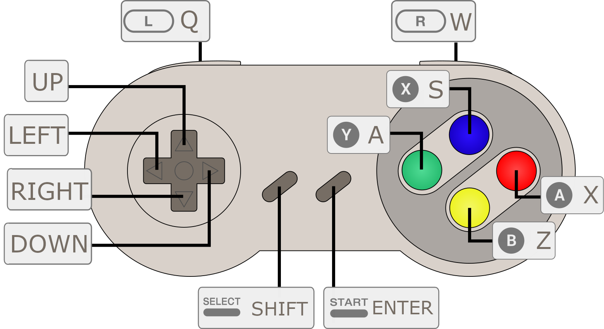

# PokeTrack

Cross-platform joystick-driven music-tracker.

## installation

Grab [the latest release](https://github.com/konsumer/poketrack/releases/latest) for your platform.

You can find device-specific instructions in [DEVICES](./DEVICES.md).

## usage

You should be able to track quickly with a joystick, or keys:

It may seem a bit inscrutable at first, but input is meant to be consistent and fast with a joystick, so once you get the hang of it, it should work well. A is "edit/change value", B is "delete/reset/cancel", X is "fill column", Y is "clear column", SELECT + arrow is "change screen", and START is "play song/pattern".

**Any screen**

| Input | Purpose |
|---|---|
| SELECT + ←/↑/↓/→ | Switch to Song / Pattern / Instrument / Menu |
| START | Play/stop song |

**Song**

| Input | Purpose |
|---|---|
| ↑/↓ | Move cursor row |
| ←/→ | Scroll channels |
| A + ↑/↓ | Set pattern number in cell |
| B | Clear cell |
| SELECT + START | Play from current row |
| hold START + ↑/↓/←/→ | Toggle mute on lane 0/1/2/3 (live performance; not saved with the song) |

**Pattern**

| Input | Purpose |
|---|---|
| L / R | Previous / next pattern |
| ↑/↓ | Move cursor row |
| ←/→ | Move cursor column (note → vel → inst → fx…) |
| X / Y | Fill / clear entire column |
| START | Loop current pattern (not full song) |
| B | Clear cell |
| A + ↑/↓ | Set node/param number in cell |
| A + B | OFF or instrument-stop |

**Instrument**

| Input | Purpose |
|---|---|
| L / R | Previous / next instrument |
| ↑/↓ | Navigate slots / params |
| → / ← | Enter / leave param panel |
| A + ↑/↓ | Cycle unit type (slot) · Change value ±1 (param) |
| A + ←/→ | Change value ±16 (param) |
| A + B | Toggle slot enabled/disabled |
| A | Open file picker (FILE row) |
| B | Clear slot / reset param / clear file path |

**Menu**

| Input | Purpose |
|---|---|
| ↑/↓ | Navigate items |
| A + ↑/↓ | Change value ±1 (BPM / KEY / SCALE) |
| A + ←/→ | Change BPM ±10 |
| A | Confirm action |

### units

There are some built-in units (effects/sound-generators) that are documented [here](./src//units/README.md).

### plugins

Read more about how to make your own custom plugins [here](plugins/).

## samples & key-mapping

Samples & instruments are intentionally simple. The idea is that you can be more "in the moment" and not uncomfortably tweaking samples & key/velocity maps with a small screen & limited controls. You can do your setup offline, and save it as a SFZ (or zip of SFZ.) I also made [this editor](https://konsumer.js.org/sfzmaker/) to facilitate that. It can do cool stuff with breakbeats, lots of samples, different velocity-zones, etc.

### what about my handheld?

Read about [specific devices](DEVICES.md).

### themes

The UI is themable at launch: `poketrack --theme ~/cyber.ptt`. See [THEMES](./THEMES.md) for the file format and how to convert LGPT themes.

### CLI flags

`poketrack [options] [song.rpt]` — loads `song.rpt`/`theme.ptt` from the current directory by default; pass a path to load a different song.

| Flag | Purpose |
|---|---|
| `-f`, `--fullscreen` | Start in fullscreen |
| `--theme <file.ptt>` | Load a theme at launch |
| `--no-preview` | Disable the note preview that normally fires as the cursor moves over pattern cells — useful when editing sequences live, where you don't want every input-move to also trigger a note |
| `--width <px>` | Window width (default 480) |
| `--height <px>` | Window height (default 320) |
| `--controller` | Show a virtual SNES pad below the tracker that lights up as you press keys or gamepad buttons — handy for screen recordings. The artwork lives in `art/controller.png`, embedded in the binary by `make embed` |
| `--wav <out.wav>` | Render the song to a WAV file and exit, instead of opening the UI, eg: `poketrack --wav song.wav song.rpt` |
| `-h`, `--help` | Print this table and exit |

### videos

Here are some videos:

## development

I use `make` to record common tasks (and `cmake` to actually build) so you can run `make` to get documentation.

## join us

If you have anyhting you want to talk about on Discord, [join us](https://discord.gg/3PXnP5cgCY)!
